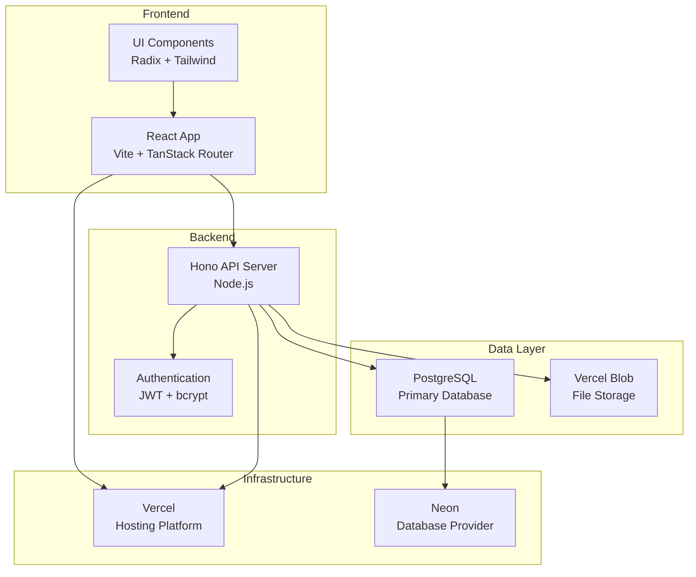
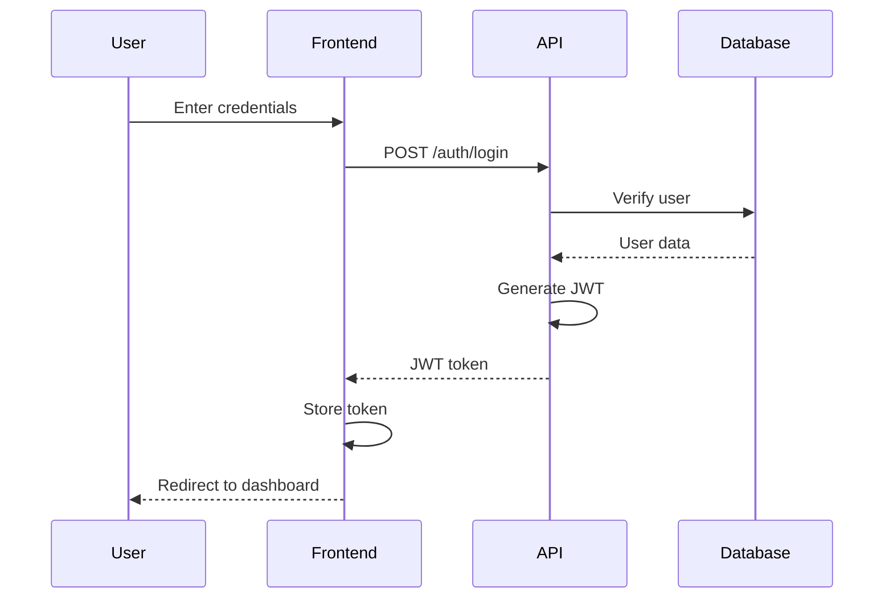
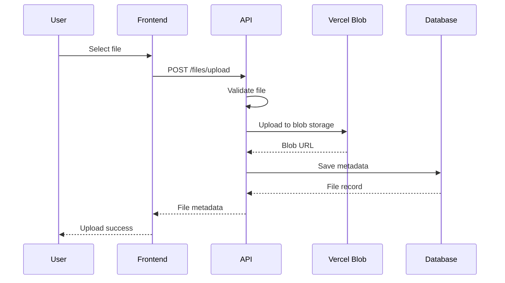

# Architecture

DataRoom MVP is built with a modern, scalable architecture designed for performance, maintainability, and developer experience.

## 🏗️ System Architecture

### High-Level Overview

## 📦 Monorepo Structure

The project uses **pnpm workspaces** with a well-organized monorepo structure:

### Applications (`apps/`)

#### `web/` - Frontend Application
- **Framework**: React 19 with TypeScript
- **Routing**: TanStack Router (type-safe routing)
- **Styling**: Tailwind CSS with custom design system
- **State Management**: TanStack Query for server state
- **Build Tool**: Vite for fast development and builds

#### `api/` - Backend Server
- **Framework**: Hono (lightweight, fast web framework)
- **Database**: Drizzle ORM with PostgreSQL
- **Authentication**: JWT with bcrypt password hashing
- **File Storage**: Vercel Blob for secure file uploads
- **Runtime**: Node.js

#### `docs/` - Documentation Site
- **Framework**: Next.js with Nextra
- **Content**: MDX for rich documentation
- **Theme**: Custom theme matching brand design

### Packages (`packages/`)

#### `ui/` - Component Library
- **Base**: Radix UI primitives
- **Styling**: Class Variance Authority (CVA)
- **Theme**: Consistent design tokens
- **Components**: Button, Card, Input, Dialog, etc.

#### `types/` - Type Definitions
- **Shared Types**: Common TypeScript interfaces
- **API Types**: Request/response type definitions
- **Database Types**: Generated from Drizzle schema

#### `auth/` - Authentication Utilities
- **JWT**: Token generation and verification
- **Password**: Hashing and comparison utilities
- **Validation**: Authentication middleware

#### `models/` - Database Models
- **Schema**: Drizzle ORM table definitions
- **Migrations**: Database migration files
- **Validations**: Zod schemas for data validation

#### `constants/` - Shared Constants
- **File Uploads**: Size limits, allowed types
- **API**: Endpoint definitions and status codes
- **Validation**: Common validation rules

#### `utils/` - Utility Functions
- **Date**: Date formatting and manipulation
- **File**: File type detection and formatting
- **String**: Text processing utilities
- **Validation**: Common validation helpers

## 🔄 Data Flow

### Authentication Flow

### File Upload Flow

## 🛠️ Technology Choices

### Frontend Stack

#### React 19
- **Concurrent Features**: Better performance with concurrent rendering
- **Server Components**: Future-ready architecture
- **Improved TypeScript**: Better type inference and checking

#### TanStack Router
- **Type Safety**: Fully type-safe routing with TypeScript
- **Code Splitting**: Automatic route-based code splitting
- **Search Params**: Type-safe search parameter handling
- **File-based**: Intuitive file-based routing system

#### Tailwind CSS
- **Utility-first**: Rapid UI development
- **Customization**: Easy theme customization
- **Performance**: Purged CSS for optimal bundle size
- **Developer Experience**: IntelliSense support

### Backend Stack

#### Hono
- **Performance**: Faster than Express with modern JavaScript
- **TypeScript**: Built with TypeScript from the ground up
- **Middleware**: Rich ecosystem of middleware
- **Edge Ready**: Works on Vercel Edge Functions

#### Drizzle ORM
- **Type Safety**: Fully type-safe database operations
- **Performance**: Lightweight with minimal overhead
- **Developer Experience**: Great IntelliSense and autocompletion
- **Migrations**: Robust migration system

#### PostgreSQL
- **Reliability**: Battle-tested database system
- **Features**: Rich feature set for complex applications
- **Performance**: Excellent query performance
- **Ecosystem**: Great tooling and cloud support

## 🏛️ Design Patterns

### Component Architecture

#### Atomic Design
- **Atoms**: Basic UI elements (Button, Input)
- **Molecules**: Combined atoms (SearchBar, FileCard)
- **Organisms**: Complex components (FileList, Navigation)
- **Templates**: Page layouts
- **Pages**: Complete page implementations

#### Composition over Inheritance
- **Composable Components**: Flexible, reusable components
- **Render Props**: Flexible component APIs
- **Custom Hooks**: Reusable stateful logic

### State Management

#### Server State
- **TanStack Query**: Efficient server state management
- **Caching**: Intelligent caching strategies
- **Background Updates**: Keep data fresh automatically

#### Client State
- **React State**: Local component state
- **Context API**: Shared application state
- **URL State**: State derived from URL parameters

## 🔒 Security Architecture

### Authentication & Authorization
- **JWT Tokens**: Stateless authentication
- **HTTP-only Cookies**: Secure token storage (planned)
- **Role-based Access**: User roles and permissions
- **Session Management**: Automatic token refresh

### Data Security
- **Input Validation**: Server-side validation with Zod
- **SQL Injection**: Protected by Drizzle ORM
- **File Upload Security**: Type and size validation
- **CORS**: Proper cross-origin resource sharing

### Infrastructure Security
- **HTTPS**: Encrypted communication
- **Environment Variables**: Secure configuration
- **Database Security**: Connection encryption
- **File Storage**: Secure blob storage with signed URLs

## 📊 Performance Considerations

### Frontend Performance
- **Code Splitting**: Route-based and component-based splitting
- **Lazy Loading**: On-demand component loading
- **Image Optimization**: Optimized image loading
- **Bundle Analysis**: Regular bundle size monitoring

### Backend Performance
- **Database Indexing**: Optimized database queries
- **Connection Pooling**: Efficient database connections
- **Caching**: Strategic caching at multiple levels
- **Pagination**: Efficient large dataset handling

### Infrastructure Performance
- **CDN**: Global content delivery
- **Edge Functions**: Reduced latency with edge computing
- **Database Location**: Co-located database and application
- **Monitoring**: Performance monitoring and alerting

---

Next: Explore the [API Reference](/api) for detailed endpoint documentation!